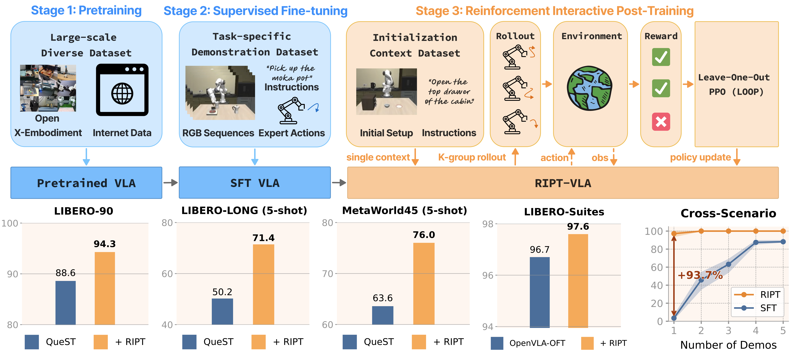

# 💪 RIPT-VLA

**Interactive Post-Training for Vision-Language-Action Models**  
Official implementation of RIPT-VLA. Parts of the repo are built on a fork of [QueST](https://quest-model.github.io).

> **RIPT-VLA** improves *any* pretrained VLA backbone (e.g., **QueST**, **OpenVLA-OFT**) using only **sparse binary success rewards**.  
> Through **K-rollout interaction**, **dynamic sampling**, and **leave-one-out advantage estimation**, we reach state-of-the-art success rates and successful in extremely low-data regimes.

<p align="center">
  
</p>

[📝 Paper](https://www.arxiv.org/abs/2505.17016) | [🌐 Website](https://ariostgx.github.io/ript_vla/)

**Authors:** *Shuhan Tan, Kairan Dou, Yue Zhao, Philipp Krähenbühl*  
**Contact:** \<shuhan@utexas.edu\>

## 🔥 Highlights
* **Plug-and-Play Post-Training** – fine-tune *any* VLA model with only task-success signals (no dense rewards, no value nets).  
* **SOTA-performance** – **94.3%** success rate on LIBERO-90 with QueST + RIPT; **97.6** success rate on LIBERO Suites (Goal, Spatial, Object, Long) with OpenVLA-OFT + RIPT.
* **Low-data Regime** – Extreme Low-Data Success – RIPT-VLA turns failure-prone models (e.g., 4% success with 1 demo) into performant agents (**97+**) using only sparse binary rewards and just 15 iterations.

## 📚 Table of Contents

1. [Getting Started](#🚀-getting-started)
2. [Model Zoo](#🤗-model-zoo)
3. [Quest RIPT Training](#🏋️-quest-ript-training)
4. [OpenVLA-OFT RIPT Training](#🏋️-openvla-oft-ript-training)
5. [Core RIPT Code Overview](#🧪-core-ript-code-overview)
6. [Citation](#📖-citation)
7. [Acknowledgement](#🙏-acknowledgement)

## 📢 News
*2025-05*  Initial code release v0.1.0!


## 📌 TODO

### 1 · Checkpoints
- [x] **QueST → RIPT-VLA** (LIBERO-90, LIBERO-Suites).
- [x] **OpenVLA-OFT → RIPT-VLA** (LIBERO-Suites).

### 2 · Code
- [x] Repo cleanup for first release.
- [ ] Meta-World Experiments.
- [ ] Better modularization of RIPT.


## 🚀 Getting Started

### 💠 Installation

Follow the instructions in [INSTALL.md](INSTALL.md) for QueST and OpenVLA-OFT.

### 📦 Paths
Replace the following paths in `config/paths.yaml`:

```yaml
paths:
  output_prefix: /path/to/experiment/output # Checkpoint and log output directory
  data_prefix: /path/to/libero/data # LIBERO data directory
  wandb_project: ript-vla # Your wandb project name
```

### Quick Start: RIPT a SFT Model on LIBERO-90

This is an example of how to RIPT a SFT QueST model on LIBERO-90:

1. Install Quest and LIBERO following [INSTALL.md](INSTALL.md)
2. Download the pre-trained SFT model [here](https://huggingface.co/tanshh97/RIPT_VLA/tree/main/quest) (check the Model Zoo section for more checkpoints).

- (optional) Evaluate the SFT model on LIBERO-90:
  - Fill in the path for `checkpoint_path` with the SFT checkpoint path in the evaluation script in `scripts/quest/eval/libero_90.sh`
  - Run the evaluation script with the number of GPUs you want to use:
  ```bash
  bash scripts/quest/eval/libero_90.sh $NUM_GPU
  ```
3. Run the RIPT script with the number of GPUs you want to use:
  - Fill in the path for `checkpoint_path` with the SFT checkpoint path in the RIPT script in `scripts/quest/stage_3_ript/libero_90.sh`
  - Run the RIPT script with the number of GPUs you want to use:
    ```bash
    bash scripts/quest/stage_3_ript/libero_90.sh $NUM_GPU
    ```

The script will:
- Load the pre-trained SFT model
- Run RIPT training on LIBERO-90
- Log results to WandB
- Use `$NUM_GPU` to specify the number of GPUs to use (Recommended at least 3 GPUs).

For complete details of the training process, see the [Quest + RIPT Training](#🏋️-quest-ript-training) section.


## 🤗 Model Zoo
All checkpoints are hosted at HuggingFace Model Hub: https://huggingface.co/tanshh97/RIPT_VLA/tree/main

### QueST Checkpoints

We provide both SFT and RIPT checkpoints for QueST on multiple LIBERO suites:

| Benchmark      | Model     | SFT Checkpoint                                                                                 | RIPT Checkpoint                                                                                |
|----------------|-----------|-----------------------------------------------------------------------------------------------|-----------------------------------------------------------------------------------------------|
| LIBERO-90      | QueST     | [Download](https://huggingface.co/tanshh97/RIPT_VLA/blob/main/quest/LIBERO_90_sft.pth)     | [Download](https://huggingface.co/tanshh97/RIPT_VLA/blob/main/quest/LIBERO_90_ript.pth)   |
| LIBERO-GOAL    | QueST     | [Download](https://huggingface.co/tanshh97/RIPT_VLA/blob/main/quest/LIBERO_GOAL_sft.pth)   | [Download](https://huggingface.co/tanshh97/RIPT_VLA/blob/main/quest/LIBERO_GOAL_ript.pth) |
| LIBERO-LONG    | QueST     | [Download](https://huggingface.co/tanshh97/RIPT_VLA/blob/main/quest/LIBERO_LONG_sft.pth)   | [Download](https://huggingface.co/tanshh97/RIPT_VLA/blob/main/quest/LIBERO_LONG_ript.pth) |
| LIBERO-OBJECT  | QueST     | [Download](https://huggingface.co/tanshh97/RIPT_VLA/blob/main/quest/LIBERO_OBJECT_sft.pth) | [Download](https://huggingface.co/tanshh97/RIPT_VLA/blob/main/quest/LIBERO_OBJECT_ript.pth) |
| LIBERO-SPATIAL | QueST     | [Download](https://huggingface.co/tanshh97/RIPT_VLA/blob/main/quest/LIBERO_SPATIAL_sft.pth)| [Download](https://huggingface.co/tanshh97/RIPT_VLA/blob/main/quest/LIBERO_SPATIAL_ript.pth) |

All models are ~80MB.

### OpenVLA-OFT Checkpoints

We provide both pre-trained and SFTed OpenVLA-OFT checkpoints for LIBERO-Suites:

| Benchmark      | Model     | SFT Scale Head                                                                                 | RIPT LoRA Adaptor                                                                                |
|----------------|-----------|-----------------------------------------------------------------------------------------------|-----------------------------------------------------------------------------------------------|
| LIBERO-GOAL | OpenVLA-OFT     | [Download](https://huggingface.co/tanshh97/RIPT_VLA/blob/main/openvla_oft/scale_header/LIBERO_GOAL_scale_header.pth)| [Download](https://huggingface.co/tanshh97/RIPT_VLA/tree/main/openvla_oft/ript_adaptors/LIBERO_GOAL_lora) |
| LIBERO-LONG | OpenVLA-OFT     | [Download](https://huggingface.co/tanshh97/RIPT_VLA/blob/main/openvla_oft/scale_header/LIBERO_LONG_scale_header.pth)| [Download](https://huggingface.co/tanshh97/RIPT_VLA/tree/main/openvla_oft/ript_adaptors/LIBERO_LONG_lora) |
| LIBERO-OBJECT | OpenVLA-OFT     | [Download](https://huggingface.co/tanshh97/RIPT_VLA/blob/main/openvla_oft/scale_header/LIBERO_OBJECT_scale_header.pth)| [Download](https://huggingface.co/tanshh97/RIPT_VLA/tree/main/openvla_oft/ript_adaptors/LIBERO_OBJECT_lora) |
| LIBERO-SPATIAL | OpenVLA-OFT     | [Download](https://huggingface.co/tanshh97/RIPT_VLA/blob/main/openvla_oft/scale_header/LIBERO_SPATIAL_scale_header.pth)| [Download](https://huggingface.co/tanshh97/RIPT_VLA/tree/main/openvla_oft/ript_adaptors/LIBERO_SPATIAL_lora) |

Laplace Scale Head are around 300MB and RIPT LoRA Adaptor + Header are around 1GB.

## 🏋️ Quest RIPT Training

Activate the `ript-vla` conda environment and run the following commands:

### Stage 1: (Optional) Pre-Training of QueST autoencoder

- *You can skip this stage if you are using SFT checkpoints from the Model Zoo.*
- Run `scripts/quest/stage_1_autoencoder/libero_*.sh` for different LIBERO suites.
- This stage only trains the autoencoder of QueST that is used for SFT.
- Only 1 GPU is needed.
- Example for LIBERO-90:
```bash
bash scripts/quest/stage_1_autoencoder/libero_90.sh
```

### Stage 2: (Optional) Supervised Fine-Tuning of QueST

- *You can skip this stage if you are using SFT checkpoints from the Model Zoo.*
- Run `scripts/quest/stage_2_sft/libero_*.sh` for different LIBERO suites.
- This stage conducts supervised fine-tuning of QueST.
- Only 1 GPU is needed.
- Example for LIBERO-90:
```bash
bash scripts/quest/stage_2_sft/libero_90.sh
```

### Stage 3: RIPT (Reinforcement Interactive Post-Training)
- Check `scripts/quest/stage_3_ript/libero_*.sh` for different LIBERO suites.
- Fill in the path for `checkpoint_path` with the SFT checkpoint path (either from Stage 2 or downloaded from the Model Zoo).
- Use `$NUM_GPU` to specify the number of GPUs to use (Recommended 3 GPUs for LIBERO suites and 6 GPUs for LIBERO-90).
- This stage conducts RIPT training of QueST.
- Example for LIBERO-90:
```bash
bash scripts/quest/stage_3_ript/libero_90.sh $NUM_GPU
```

Key flags:

* `algo.rloo_batch_size`: number of rollouts to use for RLOO K-sampling (default: 8)
* `algo.num_ppo_epochs`: number of PPO epochs (default: 20)
* `algo.ppo_batch_size`: number of PPO batches (default: 6 = 1 * 6 GPU)
* `train_dataloader.batch_size`: batch size for training (default: 180 = 30 initializations * 6 GPU)
* `training.n_steps`: number of training steps (default: 15)
* `training.rollout_steps`: number of rollout interval steps (default: 3)
* `algo.enable_dynamic_sampling`: enable dynamic sampling (default: true)

### Evaluation

- Run `scripts/quest/eval/libero_*.sh` for different LIBERO suites.
- Fill in the path for `checkpoint_path` with the RIPT/SFT checkpoint path.
- Example for LIBERO-90:
```bash
bash scripts/quest/eval/libero_90.sh $NUM_GPU
```


## 🏋️ OpenVLA-OFT RIPT Training

Activate the `ript_vla_openvla_oft` conda environment and run the following commands:

### Stage 1 + Stage 2: Pre-Training + SFT of OpenVLA-OFT on LIBERO-Suites

- We directly use the pre-trained and SFTed OpenVLA-OFT checkpoint from the [OpenVLA-OFT repo](https://github.com/moojink/openvla-oft/blob/main/LIBERO.md).
- Download the OpenVLA-OFT full model from the official OpenVLA-OFT model for each task suite.
- Download the SFTed scale head from the [Model Zoo](#🤗-model-zoo) for each task suite.

### Stage 3: RIPT of OpenVLA-OFT on LIBERO-Suites

- Check `scripts/openvla_oft/stage_3_ript/libero_*.sh` for different LIBERO suites.
- Fill in the path for `checkpoint_path` with the SFT checkpoint path from the official OpenVLA-OFT repo.
- Fill in the path for `header_checkpoint` with the SFTed scale head from the [Model Zoo](#🤗-model-zoo).
- Fill in the path for `lora_adaptor_ckpt` with the RIPT LoRA Adaptor checkpoint:
  - With the model from the [Model Zoo](#🤗-model-zoo) if finetune from current RIPT model, or
  - With `null` if finetune from SFT model.
- Use `$NUM_GPU` to specify the number of GPUs to use (Recommended 4 GPUs for LIBERO suites).
- This stage conducts RIPT training of OpenVLA-OFT.
- Example for LIBERO-LONG:
```bash
bash scripts/openvla_oft/stage_3_ript/libero_long.sh $NUM_GPU
```

### Evaluation

- Run `scripts/openvla_oft/eval/libero_*.sh` for different LIBERO suites.
- Fill in the path for `checkpoint_path` with the SFT checkpoint path from the official OpenVLA-OFT repo.
- Fill in the path for `header_checkpoint` with the SFTed scale head from the [Model Zoo](#🤗-model-zoo).
- Fill in the path for `lora_adaptor_ckpt` with the RIPT LoRA Adaptor checkpoint:
  - With the RIPT model saved from Stage 3, or
  - With the SFTed LoRA Adaptor checkpoint from the [Model Zoo](#🤗-model-zoo) (if finetune from SFT model), or
  - Set to `null` for evaluation from SFT model.

- Example for LIBERO-GOAL:
```bash
bash scripts/openvla_oft/eval/libero_long.sh $NUM_GPU
```


## 🧪 Core RIPT Code Overview

### 1. Model Interface

`ModelAdapter` provides an adaptation layer that connects the VLA models to the RIPT optimizer. It handles:
* Path: `ript/algos/rl_optimizers/model_interface.py`
* Computing action log probabilities
* Retrieving the policy model for optimization

### 2. Libero Runner with Context Caching

`LiberoRunner_rl` handles the interaction with the Libero environment with context caching:
* Path: `ript/env_runner/libero_runner.py: LiberoRunner_rl`
* Supports batch rollout generation
* Manages task-specific context caching (e.g., context tokens, output action indices) for action log probability computation

### 3. Rollout Generator

`RolloutGenerator` handles the generation of rollouts for RL training with Dynamic Sampling:
* Path: `ript/algos/rl_optimizers/rollout_generator.py`
* Manages environment interactions
* Gathers rollouts across environments
* Supports early stopping to improve efficiency
* Handles distributed rollout generation

### 4. RL Optimizer

`RLOptimizer` implements the Leave-on-out PPO (LOOP) algorithm:
* Path: `ript/algos/rl_optimizers/rl_optimizer.py`
* Processes generated rollouts
* Computes rewards and advantages with Leave-One-Out Advantage Estimation
* Applies PPO updates to the policy
* Collects and returns optimization metrics

### How to add a new VLA model?

1. Implement the `ModelAdapter` for the new model following the current `ModelAdapter` interface.
2. Implement the `LiberoRunner_rl` for the new model to cache model context for action log probability computation. For example, `LiberoRunner_rl` caches the context tokens and output action indices for QueST.
3. Add the new model and RIPT config following the existing `quest_rl.yaml` and `openvla_oft_rl.yaml` format.


## 📖 Citation

If you find this work useful, please cite:

```bibtex
@misc{tan2025interactiveposttrainingvisionlanguageactionmodels,
      title={Interactive Post-Training for Vision-Language-Action Models}, 
      author={Shuhan Tan and Kairan Dou and Yue Zhao and Philipp Krähenbühl},
      year={2025},
      eprint={2505.17016},
      archivePrefix={arXiv},
      primaryClass={cs.LG},
      url={https://arxiv.org/abs/2505.17016}, 
}
```


## 🙏 Acknowledgement

RIPT-VLA builds on open-source efforts of:

* [QueST (Mete et al., 2024)](https://quest-model.github.io/) - We forked the QueST repo and build our RIPT-VLA on top of it; we trained and finetuned our SFT QueST models with the original QueST codebase.
* [OpenVLAOFT (Kim et al., 2025)](https://github.com/moojink/openvla-oft/) - We finetuned from the released OpenVLA-OFT checkpoint.
* [LIBERO Benchmark (Liu et al., 2023)](https://libero-project.github.io/) - We used the LIBERO-90, LIBERO-Goal, LIBERO-Long, LIBERO-Object, and LIBERO-Spatial benchmarks.

We sincerely thank the authors of the above projects for their open-source contributions.
